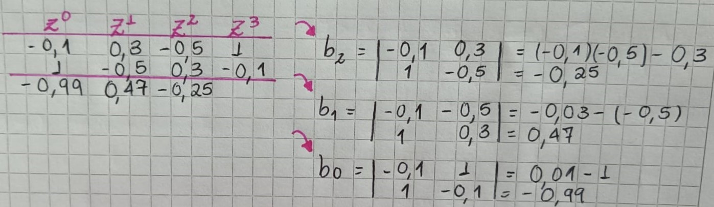

22/08/2024
# ESTABILIDAD EN SISTEMAS DISCRETOS 
La estabilidad es un concepto clave en el análisis de sistemas de control de movimiento que evolucionan en intervalos discretos de tiempo, ya que un sistema discreto se considera estable si su respuesta a una entrada se mantiene acotada conforme avanza el tiempo. En este contexto, el análisis en el espacio de Laplace mantiene el mismo concepto de estabilidad, aunque la representación de la frontera de estabilidad cambia: En lugar de estar representada por el eje vertical, se representa mediante un círculo en el plano z. Para evaluar la estabilidad de estos sistemas discretos, se utilizan diferentes enfoques, como la estabilidad asintótica, la estabilidad BIBO (Bounded Input-Bounded Output) y el criterio de estabilidad de Jury.
## Estabilidad absoluta
>🔑 Definición: Se se aplica un patrón en la entrada y la respuesta (salida) tiene las mismas características, entonces es ESTABLE.

* Con la anterior imagen se tiene la siguiente equivalencia en el plano Z: $$z=e^{Ts}$$
  Expresando: $$s= \sigma+jw$$
* Tres situaciones:
  1. Para $$\sigma>0 \to \lim_{\sigma \to 0} e^{\sigma T} = 1$$
     $$\lim_{\sigma \to \infty } e^{\sigma T} = \infty $$
     *El sistema es INESTABLE
  2. Para $$\sigma = 0 \to e^{\sigma T} = 1$$
     *El sistema es marginalmente estable
  3. Para $$\sigma < 0 \to \lim_{\sigma \to 0} = e^{-\sigma T}=1$$ y 
     $$\lim_{\sigma \to \infty } = e^{-\sigma T}= 0$$
     *El sistema es ESTABLE

* Alejarse del origen, se vuelve más lento.
* El polo dominante es aquel que está más cerca del radio 1 en el plano z.

Figura 1. Estabilidad en el plano Z

## 💡'Ejemplo 1:'
1. $$G(z)=\frac{4}{z^{3}-7.8z^{2}+13.4z+3}$$
Se iguala a 0 el denominador y se obtienen los tres polos:
$$z=5, z=3, z=0.2$$
Hay un polo dentro del radio de estabiidad, los otros dos polos están por fuera. Sistema INESTABLE

## 💡'Ejemplo 2:'
$$G(z)= \frac{z-3}{z^{3}-1.5z^{2}+0.66z-0.08}$$
Los polos son: 
$$z=0.5, z=0.8, z=0.2$$
El sistema es ESTABLE porque todos los polos están dentro de circulo unitario.

## 💡'Ejemplo 3:'
$$G(z)= \frac{-0.075997z+0.0101}{z^{2}-1.5804z+0.6238}$$
Los polos son: 
$$z=0.76, z=0.81$$
El zero sería: 0.132

## 1. Estabilidad Asintótica 
Se dice que un sistema es asintóticamente estable si su respuesta frente a una variedad de condiciones iniciales decae a cero. Se presenta mediante una ecuación muy sencilla: 
$$\lim_{k \to \infty } y(k)=0$$
Con esto se puede decir que si el sistema está limitado pero no decae a 0, entonces es marginalmente estable. El resto de respuestas hará inestable al sistema.

## 2. Estabilidad BIBO(Boundary INPUT,Boundary OUTPUT)
Una respuesta acotada a una entrada acotada permanece acotada en la salida. Uno de los métodos más comunes para evaluar este tipo de estabilidad es el Test de Jury, que utiliza criterios específicos que un sistema debe cumplir para garantizar su estabilidad.
### 2.1 Test de Jury 
Sabiendo que el polinomio caracteristico de una función de transferencia en el plano z, es el siguiente: 
$$D(z)= a_{0}z^{n}+a_{1}z^{n-1}+...+a_{n-1}z+a_{n}$$
#### 2.1.1 Condiciones:
1. $$a_{0}>0$$
2. $$a_{n} < a_{0}$$
3. $$P(z)|_{z=1}>0$$
4. $$P(z)|_{z=1}\to > 0 para n par$$ 
   $$\to < 0 para n impar$$ 
5. Construir arreglo de Jury. Con tres términos al final se termina de realizar el arreglo.
>🔑 Condición: Si al menos una no se cumple, el sistema es inmediatamente INESTABLE.

#### 2.1.2 Criterio de estabilidad de Jury

Figura 2. Tabla arreglo de Jury. Tomada de: https://aulas.ecci.edu.co/course/view.php?id=9304

Este criterio consiste en organizar los coeficientes de las potencias de  z en orden ascendente de acuerdo con sus exponentes. En la segunda fila, se utilizan los mismos coeficientes, pero en orden inverso. Esto permite calcular la siguiente ecuación matemática para determinar los valores requeridos: 
*Una matriz 2x2 que relaciona la primera columna de la tabla con la ultima pero con los coeficientes invetidos:
$$b_{n-1}=|\begin{matrix}
a_{0} & a_{n-1}\\
a_{n-1} & a_{1}
\end{matrix}|$$
Lo que es igual a: 
$$a_{n}a_{1}-a_{0}a_{n-1}$$
Se resuelve cada arreglo de matrices hasta llegar a b0, donde:
$$b_{0}=|\begin{matrix}
a_{n} & a_{0}\\
a_{0} & a_{n}
\end{matrix}|$$
Lo que es igual a: 
$$a_{n}a_{n}-a_{0}a_{0}$$
Se vuelve a rellenar la cuarta fila con los mismos coeficientes pero invertidos y se repite el proceso hasta obtener tres valores al final de la tabla.

##### 2.1.2.1 Condiciones después del arreglo de Jury 
Después de obtener los tres valores al final del arreglo de Jury, se evaluan las siguientes condiciones:
1. $$\left| b_{0} \right| = \left| b_{n-1} \right|$$
2. $$\left| c_{0} \right| = \left| c_{n-2} \right|$$
3. $$\left| s_{0} \right| = \left| s_{3} \right|$$
4. Y en el caso de la Img.12, el ultimo valor a evaluar será $$\left| r_{0} \right| = \left| r_{2} \right|$$
>🔑 Condición: Si al menos una no se cumple, el sistema es inmediatamente INESTABLE.

## 💡Ejemplo 4: 
Una vez comprendidos los criterios de estabilidad de Jury, se presenta el siguiente ejemplo:
* Polinomio característico:
$$z^{4} - 1.2z^{3} + 0.07z^{2} + 0.3z - 0.08 = 0$$

* Evaluación de condiciones: 
1. $$a_{0} > 0 $$, en este caso: $$1 > 0$$
2. $$|a_{n}| < a_{0}$$, en este caso: $$0.08 < 1$$
3. $$P(z)|_{z=1}$$, en este caso: $$(1)^{4} - 1.2*(1)^{3} + 0.07*(1)^{2} + 0.3*(1) - 0.08 = 0.09 > 0$$
4. $$P(z)|_{z=-1}$$, en este caso: $$(-1)^{4} - 1.2*(-1)^{3} + 0.07*(-1)^{2} + 0.3*(-1) - 0.08 = 1.89 > 0$$

* Cumplimiento de las condiciones, se construye el arreglo de Jury:
  
$$z^{4} - 1.2z^{3} + 0.07z^{2} + 0.3z - 0.08 = 0$$

| $$z^{0}$$  | $$z^{1}$$ | $$z^{2}$$  | $$z^{3}$$ | $$z^{4}$$ |
| ------ | ------ | ------ | ------ | ------ |
| -0.08  | 0.3 | 0.07 | -1.2 | 1 |
| 1 | -1.2  | 0.07 | 0.3 | -0.08 |

Realiza el calculo de las determinantes:

* (-0.08)(-1.2) - (1)(0.3) = -0.204
* (-0.08)(0.07) - (1)(0.07) = -0.0756
* (-0.08)(0.3) - (1)(-1.2) = 1.176
* (-0.08)(-0.08) - (1)(1) = -0.994

| $$z^{0}$$  | $$z^{1}$$ | $$z^{2}$$  | $$z^{3}$$ | $$z^{4}$$ |
| ------ | ------ | ------ | ------ | ------ |
| -0.08  | 0.3 | 0.07 | -1.2 | 1 |
| 1 | -1.2  | 0.07 | 0.3 | -0.08 |
| ------ | ------ | ------ | ------ | ------ |
| -0.994 | 1.176 | -0.0756 | -0.204 |
| -0.204 | -0.0756  | 1.176 | -0.994 |

* (-0.994)(-0.0756) - (-0.204)(1.176) = 0.315
* (-0.994)(1.176) - (-0.204)(-0.0756) = -1.184
* (-0.994)(-0.994) - (0.204)(0.204) = 0.946

| $$z^{0}$$  | $$z^{1}$$ | $$z^{2}$$  | $$z^{3}$$ | $$z^{4}$$ |
| ------ | ------ | ------ | ------ | ------ |
| -0.08  | 0.3 | 0.07 | -1.2 | 1 |
| 1 | -1.2  | 0.07 | 0.3 | -0.08 |
| ------ | ------ | ------ | ------ | ------ |
| -0.994 | 1.176 | -0.0756 | -0.204 |
| -0.204 | -0.0756  | 1.176 | -0.994 |
| ------ | ------ | ------ | ------ | ------ |
| 0.946 | -1.184  | 0.315 |

$$|-0.994| > |-0.204|$$
$$|-0.946| > |0.315|$$

Con relación a lo obtenido se determina que este sistema es estable.

## 💡Ejemplo 5: 
$$z^{5} + 2.6z^{4} + 0.56z^{3} -2.05z^{2} + 0.0775z + 0.35 = 0$$
1. $$1 > 0$$
2. $$0.35 < 1$$
3. $$P(z)|_{z=1}$$, en este caso: $$(1)^{5} + 2.6*(1)^{4} + 0.56*(1)^{3} - 2.05*(1)^{2} + 0.0775*(1) + 0.35 = 1.41 > 0$$
4. $$P(z)|_{z=-1}$$, en este caso: $$(-1)^{5} + 2.6*(-1)^{4} + 0.56*(-1)^{3} - 2.05*(-1)^{2} + 0.0775*(-1) + 0.35 = 0.382 > 0$$

No se está cumpliendo con el criterio de al se $$n$$ un número impar debe ser menor a 0. Por ende, el sistema es inestable

# 📚Ejercicios 
1. Se tiene la siguiente función de transferencia:
   $$G(z)=\frac{3z^{2}+2z+1}{z^{3}-0.7z^{2}+0.2z-0.1}$$
   *Se iguala a 0 el denominador y se obtienen los siguientes polos:
   $$z=0.5, z=0.2+0.4j,z=0.2-0.4j$$
   * El sistema es ESTABLE porque los polos están dentro del círculo unitario.
   * 
3. Se tiene a siguiente función de transferencia:
   $$G(z)=\frac{2+0.5z^{-1}-0.2z^{-2}}{1-0.5z^{-1}+0.3z^{-2}-0.1z^{-3}}$$
   * Se transforman las z negativas a positivas para poder realizar de una manera más efectiva el análisis de estabilidad, entonces:
     $$G(z)=\frac{2z^{3}+0.5z^{2}-0.2z}{1z^{3}-0.5z^{2}+0.3z-0.1}$$
   * Teniendo en z positivas se procede a analizar las condiciones del Test de Jury
     1. $$2>0$$ (Correcto)
     2. $$|-0.1| < 2$$ (Correcto)
     3. $$P(z)|_{z=1} = 0.7 > 0$$ (Correcto)
     4. $$P(z)|_{z=-1} = -1.9 < 0$$ (Para n impar, correcto)
  * Al no tener una condición que no se cumpla, se procede a hacer el arreglo de Jury

    

    Figura 3. Tabla arreglo de Jury ejercicio 2.

 * Al tener 3 valores al finalizar la tabla, se analizan las otras condiciones:
   1. $$|-0.99| > |-0.25|$$ (Correcto)
 * Se concluye que el sistema es ESTABLE

## Conclusiones 
La estabilidad es un requisito crucial en los sistemas de control para evitar la pérdida de control y posibles daños al equipo, y su aseguramiento se logra mediante la aplicación de métodos de análisis específicos. Técnicas como el método de los lugares de raíces, el criterio de Routh-Hurwitz y el análisis en el dominio de la frecuencia permiten evaluar cómo se comporta el sistema ante perturbaciones y variaciones de parámetros, asegurando que se mantenga dentro de un rango seguro de operación. En resumen, la estabilidad es esencial para un funcionamiento seguro y confiable, y su análisis permite prevenir problemas que podrían comprometer el rendimiento y la integridad del sistema. 

## Referencias

[1] “AulasVirtualesECCI: Entrar al sitio”, Edu.co. [En línea]. Disponible: https://aulas.ecci.edu.co/course/view.php?id=9304. [Consulta: 20 de agosto de 2024].
